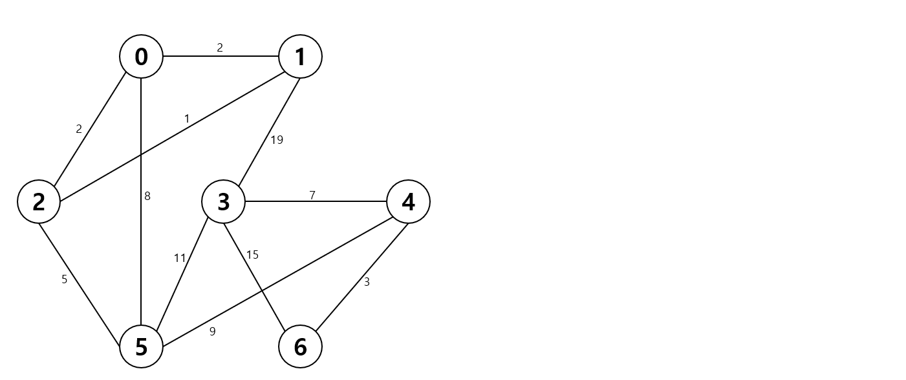

# Kruskal

위의 그래프에서 **크루스칼** 알고리즘을 활용해 MST를 구성하시오.

| 0    | 1    | 2    | 3    | 4    | 5    | 6    |
| ---- | ---- | ---- | ---- | ---- | ---- | ---- |
| 0    | 1    | 2    | 3    | 4    | 5    | 6    |

- 가중치 기준으로 오름차순 정렬
- 1-2

| 0    | 1    | 2    | 3    | 4    | 5    | 6    |
| ---- | ---- | ---- | ---- | ---- | ---- | ---- |
| 0    | 1    | 1    | 3    | 4    | 5    | 6    |

- 1-2 / 0-1

| 0    | 1    | 2    | 3    | 4    | 5    | 6    |
| ---- | ---- | ---- | ---- | ---- | ---- | ---- |
| 0    | 0    | 0    | 3    | 4    | 5    | 6    |

- 1-2 / 0-1 / 4-6

| 0    | 1    | 2    | 3    | 4    | 5    | 6    |
| ---- | ---- | ---- | ---- | ---- | ---- | ---- |
| 0    | 0    | 0    | 3    | 4    | 5    | 4    |

- 1-2 / 0-1 / 4-6 / 2-5

| 0    | 1    | 2    | 3    | 4    | 5    | 6    |
| ---- | ---- | ---- | ---- | ---- | ---- | ---- |
| 0    | 0    | 0    | 3    | 4    | 0    | 4    |

- 1-2 / 0-1 / 4-6 / 2-5 / 3-4

| 0    | 1    | 2    | 3    | 4    | 5    | 6    |
| ---- | ---- | ---- | ---- | ---- | ---- | ---- |
| 0    | 0    | 0    | 3    | 3    | 0    | 4    |

- 1-2 / 0-1 / 4-6 / 2-5 / 3-4 / 4-5

| 0    | 1    | 2    | 3    | 4    | 5    | 6    |
| ---- | ---- | ---- | ---- | ---- | ---- | ---- |
| 3    | 0    | 0    | 3    | 3    | 0    | 4    |
